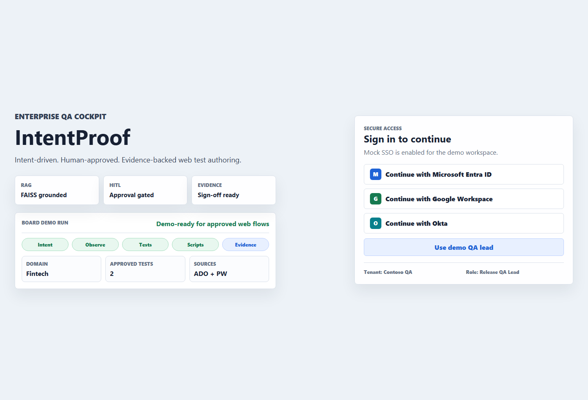
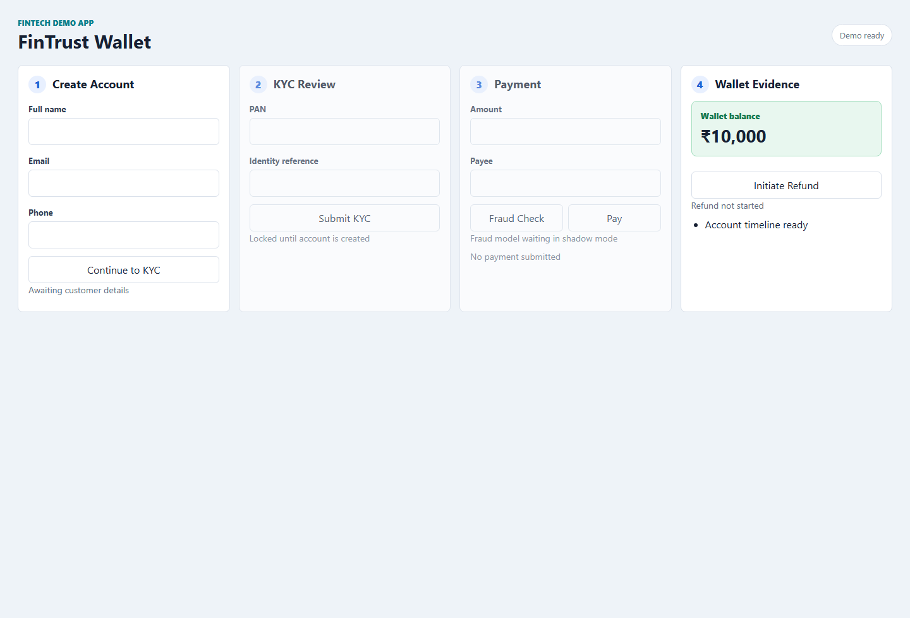

# IntentProof

Intent-driven. Human-approved. Evidence-backed web test authoring.

IntentProof is a self-contained hackathon MVP. A QA lead gives the platform a web app URL and a rough business intent. The agent generates risk-ranked QA intents, lets a human approve them, observes the app with Playwright, generates enterprise-style test cases, lets a human approve those tests, runs Playwright automation, and saves evidence.

## What It Shows

- URL + release intent input
- Mock SSO landing page for demo sign-in
- Domain Recognition Agent for fintech, healthcare, e-commerce, and generic apps
- Risk-ranked QA intent generation
- Human-in-the-loop approve/reject flow
- Playwright app observation
- Enterprise test case generation
- FAISS-backed RAG guidelines for Azure DevOps-style test cases
- Human approval before script generation
- Generated Playwright automation
- FAISS-backed RAG guidelines for modular Playwright scripting
- Human approval before script execution
- Evidence dashboard with pass/fail result
- User sign-off report with test-case-level execution status
- RAG source lineage showing which guideline chunks shaped the output
- Saved screenshots, generated scripts, and JSON reports
- Built-in fintech demo app for reliable demos
- External URL support for public demo apps

## Prerequisites

Install these first:

- Node.js 20 or newer
- npm

This project was tested with:

- Node.js `v24.15.0`
- npm `11.12.1`

## Install

From the project folder:

```bash
npm install
npm run playwright:install
```

`npm run playwright:install` installs the Chromium browser used by Playwright.

## Run

Start the app:

```bash
npm start
```

Open:

```text
http://localhost:4173
```

The bundled fintech demo app is available at:

```text
http://localhost:4173/demo-fintech
```

## Quick Demo Flow

1. Open `http://localhost:4173`.
2. Sign in with any mock SSO option or **Use demo QA lead**.
3. Keep the default target URL or choose one of the suggested target chips:

   ```text
   Demo fintech
   HDFC home loan
   Practo
   Apollo 24|7
   IRCTC
   ```

   The suggestion fills both the target URL and release intent.

4. For the most reliable end-to-end execution path, use:

   ```text
   http://localhost:4173/demo-fintech
   ```

5. Use this release intent:

   ```text
   Validate critical onboarding, primary business workflow, status updates, negative paths, and release readiness
   ```

6. Click **Generate QA Intents**.
7. Review the detected domain and generated risk-ranked intents.
8. Keep the important intents approved.
9. Click **Observe Approved Intents**.
10. Click **Generate Test Cases**.
11. Review generated enterprise test cases.
12. Click **Generate Scripts**.
13. Review the generated Playwright script summary.
14. Click **Approve & Run Scripts**.
15. Check the **Execution result** panel.
16. Open the **User sign-off report** link for the readable sign-off artifact.

A successful run shows:

```text
Demo-ready for approved web flows
```

**Flow Diagram**

```mermaid
flowchart TD
   A[User: provide URL & release intent] --> B[Domain + Intent Agents]
   B --> C[Generate risk-ranked QA intents (LLM or fallback)]
   C --> D[Human reviews & approves intents]
   D --> E[Playwright observe: screenshots & DOM snapshot]
   E --> F[Generate enterprise test cases (RAG + templates)]
   F --> G[Human approves test cases]
   G --> H[Generate Playwright scripts]
   H --> I[Human approves & execute scripts]
   I --> J[Run Playwright → test results, evidence & sign-off report]
   J --> K[Artifacts saved to runs/<runId>/]
```

## External URL Demo

You can replace the target URL with a public test site.

Recommended banking-style demo URL:

```text
https://parabank.parasoft.com/parabank/index.htm?ConnType=JDBC
```

Suggested intent:

```text
Validate online banking account registration, customer login, transfer funds, bill pay, and account history readiness
```

Healthcare sample:

```text
https://example-healthcare.test/patient-portal
```

Suggested intent:

```text
Validate patient appointment booking, medical record access, prescription visibility, consent, and care-team messaging readiness
```

The first step will show the detected domain, confidence, and signals before the rest of the QA workflow continues.

For external URLs, the generated smoke tests verify reachability, page title, body visibility, and screenshot evidence. The bundled fintech app gets the richer end-to-end scripted flow.

## Optional LLM Setup

The app works without an LLM by using deterministic fallback templates.

To enable live LLM generation, set:

```bash
set GROQ_API_KEY=your_api_key_here
```

Optional model override:

```bash
set GROQ_MODEL=openai/gpt-oss-120b
```

Then restart the app:

```bash
npm start
```

If no API key is present, the app still works and labels generation as fallback-based.

## RAG Guideline Layer

The demo includes a small local RAG knowledge base under:

```text
rag/guidelines.json
```

It is indexed with `faiss-node` at startup. The agent retrieves relevant chunks for two stages:

- Test cases: Azure DevOps Test Plans style fields, steps, approval, traceability, and sign-off evidence.
- Test scripts: Playwright naming conventions, modular structure, locators/assertions, error handling, evidence, and helper method signatures.

You can verify the local FAISS index is active:

```text
http://localhost:4173/api/rag/status
```

Generated outputs include source lineage in:

```text
runs/<runId>/generated-test-cases.json
runs/<runId>/script-review.json
runs/<runId>/evidence.json
runs/<runId>/signoff-report.html
```

The sign-off report explicitly shows IDs such as `ADO-TC-001` and `PW-SCRIPT-001`, so reviewers can validate which internal QA guidelines influenced each artifact.

## Output Files

Every run creates a folder under:

```text
runs/<runId>/
```

Typical files:

```text
runs/<runId>/generated-intents.json
runs/<runId>/observation.json
runs/<runId>/raw-crawl.spec.js
runs/<runId>/generated-test-cases.json
runs/<runId>/approved-test-cases.json
runs/<runId>/script-review.json
runs/<runId>/generated-tests.spec.js
runs/<runId>/evidence.json
runs/<runId>/signoff-report.html
runs/<runId>/signoff-report.md
runs/<runId>/screenshots/*.png
```

These files are useful during the demo because they prove the agent generated artifacts, executed tests, and saved evidence.

The sign-off report includes:

- Run summary and release decision
- Domain and approved test count
- Test-case-level approval and execution status
- RAG source lineage for test cases and generated scripts
- Priority, risk, expected result, steps, assertions, duration, and screenshot evidence
- QA Owner / Product Owner / Date sign-off lines

## Test The Project

Run the basic project checks:

```bash
npm test
```

## Screenshots

Live screenshots were captured from a local run and saved under `docs/screenshots`.

- Demo UI: 
- Bundled fintech demo: 


You can also run the full demo manually through the browser as described in the Quick Demo Flow.

## Troubleshooting

If Playwright says the browser executable is missing:

```bash
npm run playwright:install
```

If port `4173` is already in use, start with another port:

```bash
set PORT=4174
npm start
```

Then open:

```text
http://localhost:4174
```

If an external URL fails:

- Check that the site is reachable in your browser.
- Try the bundled demo app first.
- Some public sites block automation, change slowly, or require login.

## Hackathon Pitch

One-liner:

```text
IntentProof converts vague release intent into human-approved, executable, evidence-backed web test coverage.
```

Demo story:

```text
A fintech CTO is 72 hours from a release demo. Instead of manually creating test coverage from scratch, the QA lead gives the agent a URL and release intent. The agent identifies critical risks, generates QA intents, gets human approval, runs Playwright automation, and produces release evidence.
```

## Tech Stack

- Node.js
- Express
- Vanilla HTML/CSS/JavaScript
- Playwright
- FAISS through `faiss-node`
- Optional LLM call through `GROQ_API_KEY` and `GROQ_MODEL`

## Project Structure

```text
server.js                  Backend APIs and Playwright execution
public/index.html          Main IntentProof UI
public/app.js              Frontend workflow logic
public/styles.css          UI styling
public/demo-fintech.html   Bundled fintech demo app
public/demo-fintech.js     Demo app behavior
rag/guidelines.json        RAG guideline chunks for test cases and scripts
rag/index.js               FAISS retrieval helper
tests/basic.test.js        Basic project checks
runs/                      Generated run evidence
```
